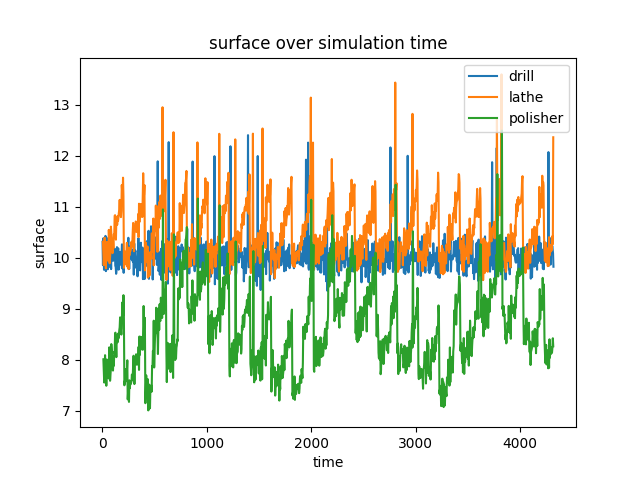

.. _example_4:

Example 04: Plot output data
----------------------------

This section shows how to use methods of the ``Environment`` class to generate simple plots of simulation data. The data
basis for the plots are the .csv files generated from the simulation. This offers the advantage of being able to
generate the plots at any time without having to run the simulation again. Of course, the plots can also be created in
one call with the simulation by calling the corresponding methods after the method ``data_to_csv``.

The methods provided here cannot offer the full variety of different plots. For individual plots the user has to work
with the raw data himself.

The two display options provided here offer the display of the progression of attributes over time and the progression
of attributes across different stations. It is also possible to create graphs containing plots from different
datasets/.csv files.

* :ref:`Plot over time <over_time>`
* :ref:`Plot over stations <over_stations>`

.. note::
   The data plotted below is taken from the simulation output generated in :ref:`example three <example_3>`.

....

.. _over_time:

Plot over time
**************

In this graph, any number of plots can be created, all of which show the expression of the same attribute of the
workpieces being processed at a particular station over time. It is even possible to plot data from different
simulation runs.

To give a concrete example, the attribute ``surface`` of the shaft from example three should be plotted over time.
However, not only the characteristics of the finished shafts are to be represented, but the characteristics at each
station in the process.

Even if the output data is already available, the environment must first be imported and an instance created. However,
since the plotting is based on .csv files, no process data must be read in. Rather, simply call the appropriate method.

.. code-block:: python

   # import the simulation environment
   from prodsim import Environment

   if __name__ == '__main__':

       # create new simulation environment
       env: Environment = Environment()

       # plot the surface quality over time
       env.plot_attr_over_time('User/user/Desktop/', 'surface', ['../data/output_data/shaft.csv', ['drill', 'lathe', 'polisher'], [0, 1, 2]] )

The method ``plot_attr_over_time`` takes three arguments. First the path to the directory in which the plot should be
saved as a .png file. The second argument is a single string, which represents the attribute, whose values should be
displayed. The last argument is an argument list, which holds a list for each .csv file data should be taken from.

These lists must follow a special structure. The first element has to be a str, which represents the path to the .csv
file with the simulation output for a particular item type. The second and third elements are list by them self and must
have the same length. The length corresponds to the number of stations on which the value of the given attribute should
be plotted. The first lists holds the labels for each plot and the second one holds the process step number of the
corresponding station in the simulated process.

In the given example, the attributes of the ``surface`` attribute are to be displayed at all three process stations
([0, 1, 2]) with the names ['drill', 'lathe', 'polisher' ]. Since only data from one file was used, the argument list
has only the length one.

The above code leads to the following result.

This graph reflects exactly the result that was to be expected. The surface quality of the shafts during drilling
corresponds to the defined initial distribution (["n", 10, 0.2]). Only in rare cases (1.5%) when the drill breaks, the
quality deteriorates by about 2 units. This corresponds to the few upward outliers in the blue plot.

In the turning process, quality is negatively affected by wear, which increases over time until maintenance is
performed. This maintenance always takes place after 50 machining operations, which corresponds to 200 time units
(50 * 4). This cycle can be seen in the orange plot in the form of the 'triangles'.

Finally, the influence of temperature can also be seen. The temperature is higher at noon than in the evening. In
addition, the temperature has a negative influence on the polishing process. Since three days have been simulated, three
'waves' can be seen on the polisher plot (blue). Since the simulation time starts at 'midnight' and the temperature
there is rather low, the surface quality in the green plot initially has a minimum.

In addition, it can be seen that the workpieces are actually moving through the process, since the outliers from
drilling can also be found in the subsequent machining shifts (with a small time delay). The same applies to the peaks
from the turning process.

....

.. _over_stations:

Plot over stations
******************

In this graphic a boxplot for one attribute can be displayed for each station for up to four different datasets.

To give a concrete example of how to create a graphic of this type, the attribute ``surface`` from example three is also
shown here. In addition, to show how data from different simulation runs can be plotted on a graph, the simulation
described in Example three is restarted, but the shafts entering the process have a different distribution, with a small
mean but a larger spread (["n", 8, 0.8]).

The following code shows how to create the graphic.

.. code-block:: python

   # import the simulation environment
   from prodsim import Environment

   if __name__ == '__main__':

       # create new simulation environment
       env: Environment = Environment()

       # plot the surface quality over time
       env.plot_attr_over_station('User/user/Desktop/', 'surface',
                                  ['../data/output_data_1/shaft.csv', 'sim_run_1'],
                                  ['../data/output_data_2/shaft.csv', 'sim_run_2'],
                                  x_labels = ['drill', 'lathe', 'polisher'])

The Method ``plot_attr_over_station`` takes four arguments. First the path to the directory, where the plot should be
saved. Second, the name of the attribute, that should be displayed. Then a argument list, which contains up to four list
of length two. Containing the path to a dataset and a string representing the label for this dataset. Last an optional
list of the length of the number of process steps, which represent the labeling of the x axis. If this list isn't set
the labels will be 'station_0', 'station_1' ,.. .

The code shown above generates the following graph.

.. image:: ../Figures/example_03_over_station.png
   :width: 100%
   :alt: Process graph

Also in this graph the same aspects can be observed as from the :ref:`plot over time <over_time>`.

As already expected from the distribution of the surface values, the mean value of the surface roughness decreases in
the second simulation run, while the scatter increases. This can be easily seen by comparing the red and blue boxplots.
In addition, it can be seen that the scatter width of the central 50 % quantile increases strongly with a small initial
scatter (blue), while it remains almost the same with an already large initial scatter (red).