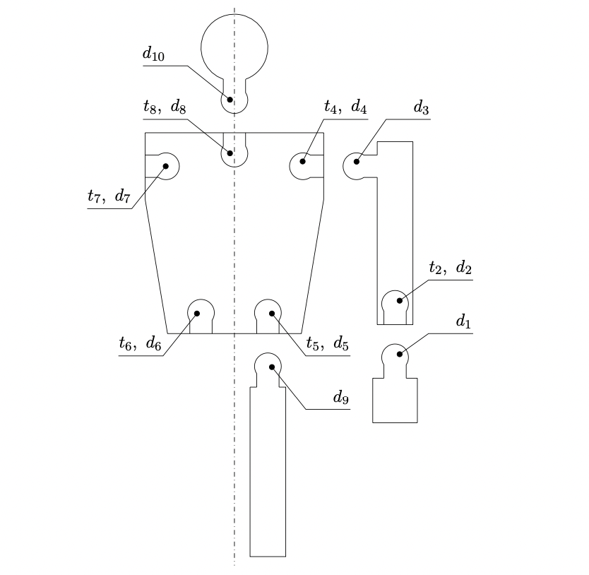
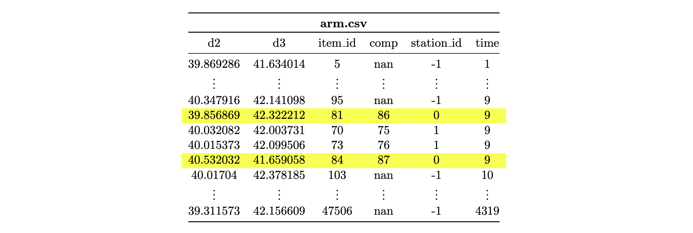
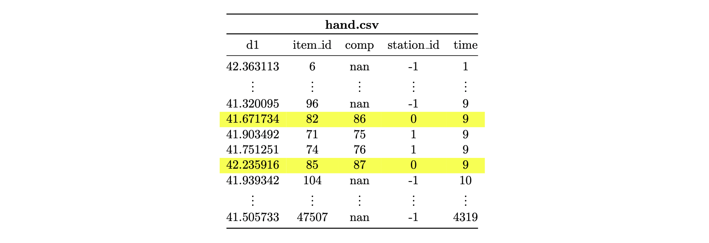
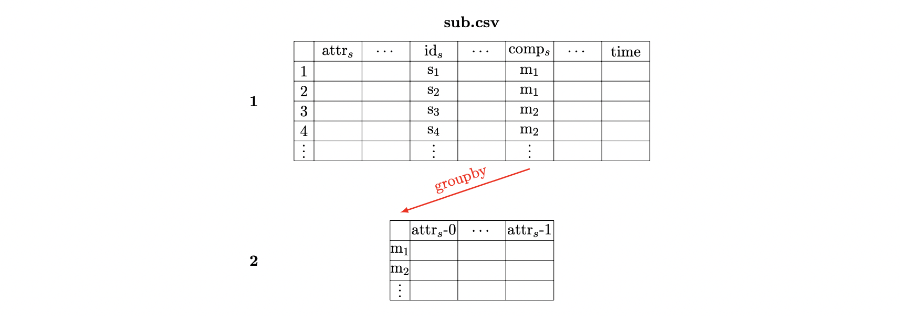

.. _4:

Example 04: Toy figure
----------------------

In this example, the characteristics of accessing assembly workpiece attributes are demonstrated. In addition, the usage
of the workpiece attributes *reject* and *item_id* is described. Finally, the output structure is presented along with how
the output can be transformed into the required format.

....

.. _process_description2:

Process description
*******************

The production of plastic toy figures serves as an example process. The following product tree describes the components,
their quantities, and the assembly relationships.

.. image:: ../Figures/figure_tree.png
   :align: center
   :width: 45%

The components *arm*, *hand*, *leg* and *head* are produced externally and do not have separate machining steps within
the process itself. The body component is injection-molded within the process. First, the components *arm* and *hand*
are assembled into the module *upper_limb*. In the following assembly process, all components are assembled in a figure.
Finally, quality is checked and incorrect figures are rejected.

.. image:: ../Figures/figure_process.png
   :align: center
   :width: 62%

The components are connected using ball-and-socket joints. Each joint has a diameter. Based on the difference in
diameters, the tension that occurs in the joint is determined. For example:

.. math::

   t_4 = t_4(d_4,d_3)

The diameters of the joints are the attributes of the respective components, whereas the resulting tensions are
determined during assembly and are therefore attributes of the modules or the final product. Since the figure is
symmetrical, all *arms*, *hands*, and *legs* have the same attributes with individual characteristics.

....

.. _assemble_func:

Assemble function
*****************

This subsection describes the assembly function that is called at the station *assemble_figure*. The argument item of
the function references the workpiece in whose process path the station from which the process function was called is
located (figure). This attribute can be used to access all assembled workpieces that are assembled before or at the
station under consideration. According to the following relationship, the tension is calculated and stored in attributes
t4 to t8 of the *figure* workpiece for each ball joint:

.. math::

   t_i(d_i,d_j) = (d_j - d_i - 2)^3 + 20

As an example, tension t4 is used to describe the access of the required diameters; t4 depends on d3 of the right *arm*
and on d4 of the body. Since item refers to figure, the module upper_limb must be accessed first. Since there are two
upper_limbs, one of the two must be selected. By definition, it is declared that the first element corresponds to the
right *upper_limb*. Since d3 is an attribute of the arm, the *upper_limb* must be used to access the *arm* and then d3.
This results in the following:

.. code-block:: python

   d3_1 = item.upper_limb[0].arm.d3

The structure is similar for the diameter d4. First, *item* (or figure) must be used to refer to *body*. Since d4 is an
attribute of body, d4 can be accessed as follows:

.. code-block:: python

   d4 = item.body.d4

The two stresses t2 have already been determined during the assembly of the component *upper_limb*.

.. code-block:: python

   def assemble_figure(env, item, machine, factory):

       # Get the diameters of the assembled items
       d3_1 = item.upper_limb[0].arm.d3
       d3_2 = item.upper_limb[1].arm.d3
       d9_1 = item.leg[0].d9
       d9_2 = item.leg[1].d9
       d10 = item.head.d10

       def get_t(d1, d2):
           return (d2 - d1 - 2)**3 + 20

       # Calculate the tension
       item.t4 = get_t(item.body.d4, d3_1)
       item.t5 = get_t(item.body.d5, d9_1)
       item.t6 = get_t(item.body.d6, d9_2)
       item.t7 = get_t(item.body.d7, d3_2)
       item.t8 = get_t(item.body.d8, d10)

       # Block the machine for the assembly time
       yield env.timeout(1)

....

.. _quality_check:

Quality check
*************

During quality control, all figures that do not fulfill the quality requirements are rejected. The criterion used here
is the tension, which must lie within a specified interval to be able to rotate the corresponding components against
each other. For each tension, a check is performed to ensure that it lies within the specified interval. If not, then
the *reject* attribute is set to *True*. Consequently, this item (including all assembled items) is removed from the
process and is not added to the following store.

In addition, the id of the figures is stored in the global attribute *rejected_id* to identify them more easily. In the
:ref:`following<identify_rejected>`, a method for identifying rejected items without global attributes is described.

.. code-block:: python

   def quality_check(env, item, machine, factory):

       # Limits for the tension
       t_min = 17.0
       t_max = 23.0

       def is_reject(t):
           if t <= t_min or t >= t_max:
               item.reject = True
               factory.rejected_id = item.item_id
               return True
           return False

       # Reject items and update profiling attributes
       if is_reject(item.t4):
           machine.r4 += 1
       if is_reject(item.t5):
           machine.r5 += 1
       if is_reject(item.t6):
           machine.r6 += 1
       if is_reject(item.t7):
           machine.r7 += 1
       if is_reject(item.t8):
           machine.r8 += 1
       if is_reject(item.upper_limb[0].t2):
           machine.r2_1 += 1
       if is_reject(item.upper_limb[1].t2):
           machine.r2_2 += 1

       # Block quality machine
       yield env.timeout(1)

The diameters of the joints are distributed as follows:

.. math::

   d_i \sim N(40,0.4)\ ,i\in\lbrace1,3,9,10\rbrace

.. math::

   d_i \sim N(42,0.4)\ ,i\in\lbrace4,..,7\rbrace

For *d8*, a normal distribution is also assumed, but the mean diameter continues to increase due to wear during the
injection. After 1500 injection processes, the mold is replaced so that the diameter starts again at 40. The following
figure visualizes the behavior on the basis of the number of rejects corresponding to the rejection reasons *r6*, *r7*,
and *r8*.

.. image:: ../Figures/rejection.png
   :align: center
   :width: 48%

.. note::

   If no attributes are changed at a station (e.g., *quality_check*), then setting the attribute *measurement* to true
   is recommended because the workpiece attributes will not be tracked at this station. This reduces the data usage.

....

.. _merge:

Merge output data
*****************

As a standard, the simulation data for each simulation object (order, station, factory) is saved in its own file. The
following text describes how these files can be merged in order to collect all information (d1,..,d10,t2,t4,..,t8)
concerning a single figure for all figures in a time series. Data merging according to the underlying assembly structure
is performed via the columns *item_id* and *comp*. Each order output whose workpieces represent assembly workpieces of
at least one other order contains the column *comp*, which contains the *item_id* of the item for which the assembly
item is assembled.

The following cutout of the csv file *arm.csv* indicates that the arm with the *item_id* 81 is mounted to an
*upper_limb* item with the *item_id* 86. Likewise, *arm* 84 is assembled to *upper_limb* 87.

In the file *hand.csv*, there are the two arms (item_ids: 82 and 85), which are mounted to the *upper_limbs* with the
item_ids 86 and 87.

Finally, in the file *upper_limb.csv*, the two workpieces with item_ids 86 and 87 can be found. They are mounted on a
*figure* with the *item_id* 77.

.. image:: ../Figures/upper_limb_csv.png
   :align: center
   :width: 80%

Based on the textually described context, the assembly structures can be automatically tracked. The following figure
provides an overview of the required steps.

1. First, the csv files must be filtered so that only the rows containing items at the last station (or at the station
   where the current assembly structure is to be traced) are left
2. All columns that are not required are removed. Only the attribute columns are kept in files representing *sub*
   components, while the *comp* column is chosen as the index. In files belonging to *main* items, the *item_id* is used
   as the index, and all columns except the *comp* and attribute columns are deleted.
3. The *main* file is connected to the *sub* file (any number of sub files can be used) via the index (the concat method
   from the pandas library is recommended).
4. If the *main* item is assembled further, the *comp* column must subsequently be selected as the index to connect the
   new file again.

.. image:: ../Figures/merge.png
   :align: center
   :width: 90%

A particular detail must be taken into account. If the demand is greater than one, then the *comp* column contains the
*item_id* of the *main* item multiple times (e.g., *upper_limb.csv* - *item_id*: 77). The following figure demonstrates
how this case is handled. The file is split off (e.g., with the groupby method from the pandas library) using the *comp*
column. Thus, the attributes are numbered to be able to differentiate them later. This ensures that the index set *comp*
is unique and can be used to merge the files.

The following code block shows how to switch a csv file to state *1* from the first figure. The *get_df* method already
considers the case of demands greater than one. Thus, the partial data sets are returned in a list.

.. code-block:: python

       def get_df(name: str, num_main_args: int, sub: bool = True, amount: int = None):

           index_col, labels = 'item_id', ['station_id']
           if sub:
               index_col, labels = 'comp', ['station_id', 'item_id']

           # set 'index_col' as row index, and remove the column 'time' for all assemble objects by usecols (+3)
           iter_csv = pd.read_csv(path + name + '.csv', usecols=[i for i in range(
               num_main_args + 3)], iterator=True, chunksize=10_000, index_col=index_col)

           # build DataFrame and remove the columns 'labels'
           temp_df = pd.concat([chunk[chunk['station_id'] == station_id] for chunk in iter_csv]).drop(labels=labels, axis=1)

           # if there are multiple objects split the dataframe an return them as a list
           if amount is None:
               return temp_df
           return [temp_df.groupby('comp').nth(i).add_suffix('-%s' % i) for i in range(amount)]

The files created in this manner must be nested by hand according to the assembly structure. The following code block
presents steps 2 and 3 for the final assembly step of a figure. Since the *figure* is the final assembly layer, the
*comp* column does not exist in this file and cannot be set as the index. The used DataFrame *upper_limb* is previously
generated according to the same logic.

.. code-block:: python

   figure = get_df("figure", 5, sub=False)
   head = get_df("head", 1)
   body = get_df("body", 5)
   legs = get_df("leg", 1, amount=2)

   figure = pd.concat([figure, head, legs[0], legs[1], upper_limb[0], upper_limb[1], body], axis=1)
   del head, legs, upper_limb, body

The following file depicts the results of this transformation. The row marked in yellow corresponds to the *figure* with
*item_id* 77. When the values of this column are compared with the elementary csv files shown at the beginning, the
values are observed to have been combined correctly. The file created in this way contains all 21 attributes of a figure
per row.

.. image:: ../Figures/merged_figure_csv.png
   :align: center
   :width: 90%

....

.. _identify_rejected:

Identify rejected items
***********************

Finally, how rejected workpieces can be identified is described. In the quality_check function, the *item_id* of
rejected items is stored globally. In the last step of the concatenation process described above, this global index set
can be used to filter the items whose *item_id* appears in this set. Similarly, if the difference set is formed instead
of the intersection set, nonrejected items can be obtained.

Alternatively, global attributes can be avoided if further process steps follow after the station at which workpieces
are declared to be rejects. First, the item_ids of all workpieces created by a source (*station_id* = -1) are summarized
in a set. Analogously, an index set can be created that contains all item_ids of items that have passed a specific
station. By forming the difference set, one receives all item_ids of workpieces that represent rejects. With this set,
as described above, the rejected workpieces can be identified.
