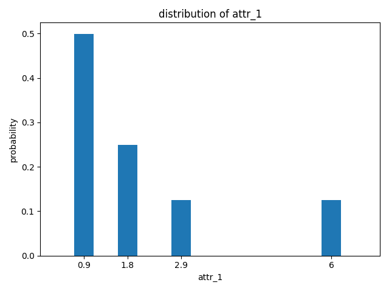
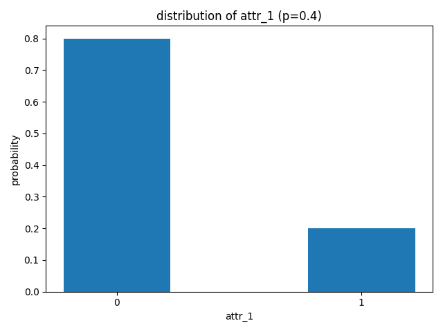
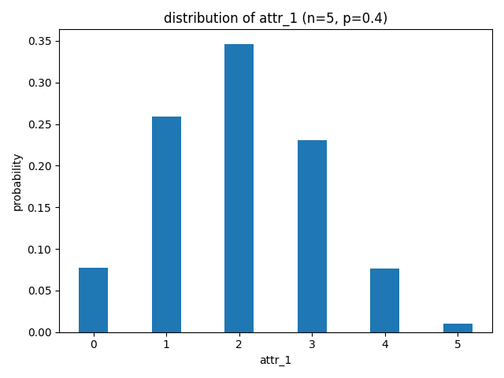

.. _attr_values:

Attribute values
----------------

This section presents the possible distributions that can be assigned to the attributes of the simulation objects. A
distribution is defined in the form of a list. The first element of the list is always a string of length 1, which
serves as an identifier for the different distributions. The remaining attributes define the specific distribution
parameters.

.. list-table::
   :header-rows: 1
   :align: center

   * - Distribution
     - Identifier
     - Parameters
   * - :ref:`User defined <user_defined>`
     - /
     - /
   * - :ref:`Fix <fix>`
     - f
     - ["f", :math:`\nu` ]
   * - :ref:`Binary <binary>`
     - b
     - ["b", *p* ]
   * - :ref:`Binomial <binomial>`
     - i
     - ["i", *n* , *p* ]
   * - :ref:`Normal <normal>`
     - n
     - ["n", :math:`\mu` , :math:`\sigma` ]
   * - :ref:`Uniform <uniform>`
     - u
     - ["u", *a* , *b* ]
   * - :ref:`Poisson <poisson>`
     - p
     - ["p", :math:`\lambda` ]
   * - :ref:`Exponential <exponential>`
     - e
     - ["e", :math:`\beta` ]
   * - :ref:`Lognormal <lognormal>`
     - l
     - ["l", :math:`\mu` , :math:`\sigma` ]
   * - :ref:`Chisquare <chisquare>`
     - c
     - ["c", *n* ]
   * - :ref:`Standard-t <standard-t>`
     - t
     - ["t", *n* ]

....

.. _user_defined:

User defined
************

If the desired distribution is not predefined, then the user can define custom distribution functions. Such a function
is defined in the global scope of the function :ref:`input file <function_file>`. The function’s name later serves as an
identifier and thus must have length 1 and not intersect with the predefined ones. Since the return value of such a
function is assigned to the attributes, the return type must be int or float. However, the defined function can have any
number of arguments of any type. In the distribution list, the arguments of this function are then passed in the same
order.

Example:

The task is to define the following distribution function, which is not predefined, and then assign it to an attribute.

.. math::

   P(X=x) = \left\{\begin{array}{ll} \frac{1}{2} & ;x=0.9 \\
			\frac{1}{4} & ;x=1.8 \\
            \frac{1}{8} & ;x=2.9 \\
            \frac{1}{8} & ;x=6 \\
            0 & ;else\\
            \end{array}\right.

It is possible to define a function that uses the values shown. Alternatively, a general function is defined that can be
used to map other arbitrary discrete distributions. For this purpose, x is used as a free identifier and choice from
numpy.random as distribution. The attributes of the function x are two lists that contain the probabilities and discrete
values.

.. code-block:: python

   from numpy.random import choice

   def x(values, probabilities) -> Union[int, float]:
      return choice(a=values, p=probabilities)

Now, this distribution needs to be added to the attribute.

.. code-block:: JSON

   "attr_1": ["x",[0.9,1.8,2.9,6],[0.5,0.25,0.125,0.125]]

.. note::

   User-defined distributions are not checked by the inspector.

....

.. _fix:

Fixed
*****

The identifier *f* indicates a fixed attribute value. The second parameter of the list specifies the fixed value
:math:`\nu` that the attribute takes. Like all other attributes, the types *int* and *float* are possible. Distribution:

Distribution:

.. math::

   P(x=\nu)=1\ ,\hspace{0.2cm} \nu\in\mathbb{R}

Example:

.. code-block:: JSON

   "prob_of_failure": ["f",4.34]

.. image:: ../Figures/distribution_f.png
   :align: center
   :width: 45%
   :alt: distribution_normal

Overview:

.. list-table::
   :header-rows: 1
   :widths: 3, 2, 8
   :align: center

   * -
     - Value
     - Explanation
   * - Identifier
     - f
     -
   * - Additional parameter
     - :math:`\nu`
     - Value
   * - Exceptions
     - InvalidFormat
     - List does not have length 2
   * -
     - InvalidType
     - :math:`\nu` is not of type int or float

....

.. _binary:

Binary
******

The identifier *b* indicates a binary attribute value. The second element of the list is the probability *p* that
the attribute takes the value 1. *B(k,p)* indicates the probability that an attribute takes the values *k*, given
probability *p*.

Distribution:

.. math::

   B(k,p) = \left\{\begin{array}{ll} p^k(1-p)^{1-k} & ;k\in\lbrace0,1\rbrace \\
			0 & ;else\end{array}\right.\ ,\hspace{0.2cm} p\in\lbrack0,1\rbrack

Example:

.. code-block:: JSON

   "attr_1": ["b",0.2]

Overview:

.. list-table::
   :header-rows: 1
   :widths: 3, 2, 8
   :align: center

   * -
     - Value
     - Explanation
   * - Identifier
     - b
     -
   * - Additional parameter
     - *p*
     - Success probability
   * - Exceptions
     - InvalidFormat
     - List does not have length 2
   * -
     - InvalidType
     - *p* is not of type int or float
   * -
     - InvalidValue
     - *p* is not between 0.0 and 1.0

....

.. _binomial:

Binomial
********

The identifier *i* indicates a binomial attribute value. The second list element is the number of trails *n*, while the
third is the success probability *p*. *B(k,p)* indicates the probability that an attribute takes the values *k*, given
probability *p* and the number of trails *n*.

Distribution:

.. math::

   B(k,n,p) = \left\{\begin{array}{ll}\binom{n}{k} p^k(1-p)^{1-k} & ;k\in\lbrace0,..,n\rbrace \\
			0 & ;else\end{array}\right.\ ,\hspace{0.2cm} p\in\lbrack0,1\rbrack

Example:

.. code-block:: JSON

   "attr_1": ["i",5,0.4]

Overview:

.. list-table::
   :header-rows: 1
   :widths: 3, 2, 8
   :align: center

   * -
     - Value
     - Explanation
   * - Identifier
     - i
     -
   * - Additional parameter
     - *n*
     - Number of trails
   * - Additional parameter
     - *p*
     - Success probability for each trail
   * - Exceptions
     - InvalidFormat
     - List does not have length 2
   * -
     - InvalidType
     - *n* is not of type int
   * -
     -
     - *p* is not of type int or float
   * -
     - InvalidValue
     - *n* is not greater than zero
   * -
     -
     - *p* is not between 0.0 and 1.0

....

.. _normal:

Normal
******

The identifier *n* indicates a normally distributed attribute. The second list entry corresponds to the mean
:math:`\mu` and the third to the standard deviation :math:`\sigma`.

Distribution:

.. math::

   p(x)=\frac{1}{\sqrt{2\pi\sigma^2}}e^{-\frac{(x-\mu)^2}{2\sigma^2}}\ ;\hspace{0.2cm} x,\mu\in\mathbb{R},\ \sigma\ge 0

Example:

.. code-block:: JSON

   "attr_1": ["n",4,2.5]

.. image:: ../Figures/distribution_n.png
   :align: center
   :width: 45%
   :alt: distribution_normal

Overview:

.. list-table::
   :header-rows: 1
   :widths: 3, 2, 8
   :align: center

   * -
     - Value
     - Explanation
   * - Identifier
     - n
     -
   * - Additional parameter
     - :math:`\mu`
     - Mean
   * -
     - :math:`\sigma`
     - Standard deviation
   * - Exceptions
     - InvalidFormat
     - List does not have length 3
   * -
     - InvalidType
     - :math:`\mu` or :math:`\sigma` is not of type int or float
   * -
     - InvalidValue
     - :math:`\sigma` is smaller than zero

....

.. _uniform:

Uniform
*******

The identifier *u* indicates a uniform distributed attribute. The second list parameter *a* is the lower limit, while
the third *b* sets the upper interval limit. The limits can be integers or floating-point numbers.

Distribution:

.. math::

   p(x) = \left\{\begin{array}{ll}\frac{1}{b-a} & ;x\in\lbrack b,..,a) \\
			0 & ;else\end{array}\right.\ ;\hspace{0.2cm} a,b\in\mathbb{R},\ b>a

Example:

.. code-block:: JSON

   "attr_1": ["u",1,2.34]

.. image:: ../Figures/distribution_u.png
   :align: center
   :width: 45%
   :alt: distribution_normal

Overview:

.. list-table::
   :header-rows: 1
   :widths: 3, 2, 8
   :align: center

   * -
     - Value
     - Explanation
   * - Identifier
     - u
     -
   * - Additional parameter
     - *a*
     - lower bound
   * -
     - *a*
     - upper bound
   * - Exceptions
     - InvalidFormat
     - List does not have length 3
   * -
     - InvalidType
     - *a* or *b* is not of type float or int
   * -
     - InvalidValue
     - *a* is greater or equal *b*

....

.. _poisson:

Poisson
*******

The identifier *p* indicates a Poisson-distributed attribute. The second list entry determines the rate :math:`\lambda`,
which must be type float or int and greater than or equal to zero. :math:`P(k,\lambda)`indicates the probability that an
attribute takes the values k, given rate  :math:`\lambda`.

Distribution:

.. math::

   P(k,\lambda) = \left\{\begin{array}{ll}\frac{\lambda^ke^{-\lambda}}{k!} & ;k\in\mathbb{N}_{\ge0} \\
			0 & ;else\end{array}\right.\ ,\hspace{0.2cm} \lambda>0

Example:

.. code-block:: JSON

   "attr_1": ["p",2.1]

.. image:: ../Figures/distribution_p.png
   :align: center
   :width: 45%
   :alt: distribution_normal

Overview:

.. list-table::
   :header-rows: 1
   :widths: 3, 2, 8
   :align: center

   * -
     - Value
     - Explanation
   * - Identifier
     - p
     -
   * - Additional parameter
     - :math:`\lambda`
     - Rate
   * - Exceptions
     - InvalidFormat
     - List does not have length 2
   * -
     - InvalidType
     - :math:`\lambda` is not of type float or int
   * -
     - InvalidValue
     - :math:`\lambda` is less than zero

....

.. _exponential:

Exponential
***********

The identifier *e* indicates an exponential distributed attribute. The second list element is the scale :math:`\beta`,
which can be a positive floating-point number.

Distribution:

.. math::

   p(x) = \left\{\begin{array}{ll} \frac{1}{\beta} e^{-\frac{x}{\beta}} & ;x \ge 0 \\
			0 & ;else\end{array}\right.\ ,\hspace{0.2cm} \beta\in\mathbb{R}_{>0}

Example:

.. code-block:: JSON

   "attr_1": ["e",2.5]

.. image:: ../Figures/distribution_e.png
   :align: center
   :width: 45%
   :alt: distribution_normal

Overview:

.. list-table::
   :header-rows: 1
   :widths: 3, 2, 8
   :align: center

   * -
     - Value
     - Explanation
   * - Identifier
     - e
     -
   * - Additional parameter
     - :math:`\beta`
     - Scale
   * - Exceptions
     - InvalidFormat
     - List does not have length 2
   * -
     - InvalidType
     - :math:`\beta` is not of type float or int
   * -
     - InvalidValue
     - :math:`\beta` is less or equal to zero

.. note::

   Often the exponential function is also defined by the rate :math:`\lambda=\frac{1}{\beta}`, instead of the scale
   :math:`\beta`. For more information see
   `numpy.random.exponential <https://numpy.org/doc/stable/reference/random/generated/numpy.random.exponential.html>`_.

....

.. _lognormal:

Lognormal
*********

The identifier *l* indicates a lognormal distributed attribute. The second list entry corresponds to the mean
:math:`\mu` and the third to the standard deviation :math:`\sigma`; :math:`\mu` and :math:`\sigma` must be of type int
or float, while :math:`\sigma` must also be greater than or equal to zero.

Distribution:

.. math::

   p(x) = \left\{\begin{array}{ll} \frac{1}{\sigma x \sqrt{2\pi}}e^{-\frac{(\ln{x}-\mu)^{2}}{2\sigma^{2}}} & ;x > 0 \\
			0 & ;else\end{array}\right.\ ,\hspace{0.2cm} \mu\in\mathbb{R},\ \sigma\in\mathbb{R}_{>0}

Example:

.. code-block:: JSON

   "attr_1": ["l",0,0.5]

.. image:: ../Figures/distribution_l.png
   :align: center
   :width: 45%
   :alt: distribution_normal

Overview:

.. list-table::
   :header-rows: 1
   :widths: 3, 2, 8
   :align: center

   * -
     - Value
     - Explanation
   * - Identifier
     - l
     -
   * - Additional parameter
     - :math:`\mu`
     - Mean
   * -
     - :math:`\sigma`
     - Standard deviation
   * - Exceptions
     - InvalidFormat
     - List does not have length 3
   * -
     - InvalidType
     - :math:`\mu` or :math:`\sigma` is not of type float or int
   * -
     - InvalidValue
     - :math:`\sigma` is less than zero

....

.. _chisquare:

Chisquare
*********

The identifier *c* indicates a chi-square distributed attribute. The second list entry determines the degrees of freedom
*n*, which must be a positive floating-point or integer.

Distribution:

.. math::

   p_{n}(x) = \left\{\begin{array}{ll} \frac{1}{2^{\frac{n}{2}}\Gamma(\frac{n}{2})}x^{\frac{n}{2}-1}e^{-\frac{x}{2}} & ;x > 0 \\
			0 & ;else\end{array}\right.\ ,\hspace{0.2cm} x\in\mathbb{R},\ n\in\mathbb{R}_{>0}

.. math::

   \Gamma(x)=\int^{-\infty}_{0}t^{x-1}e^{-t}dt

Example:

.. code-block:: JSON

   "attr_1": ["c",2]

.. image:: ../Figures/distribution_c.png
   :align: center
   :width: 45%
   :alt: distribution_normal

Overview:

.. list-table::
   :header-rows: 1
   :widths: 3, 2, 8
   :align: center

   * -
     - Value
     - Explanation
   * - Identifier
     - c
     -
   * - Additional parameter
     - *n*
     - Degrees of freedom
   * - Exceptions
     - InvalidFormat
     - List does not have length 2
   * -
     - InvalidType
     - *n* is not of type float or int
   * -
     - InvalidValue
     - *n* is less than or equal to zero

....

.. _standard-t:

Student-t
**********

The identifier *t* indicates a student-t distributed attribute. The second list entry determines the degrees of freedom
*n*, which must be a positive floating-point or integer.

Distribution:

.. math::

   p_n(x)=\frac{\Gamma(\frac{n+1}{2})}{\Gamma(\frac{n}{2})\sqrt{n\pi}}(1+\frac{x^2}{n})^{-\frac{n+1}{2}}\ ,\hspace{0.2cm} x\in\mathbb{R},\ n\in\mathbb{R}_{>0}

.. math::

   \Gamma(x)=\int^{-\infty}_{0}t^{x-1}e^{-t}dt

Example:

.. code-block:: JSON

   "attr_1": ["t",4]

.. image:: ../Figures/distribution_t.png
   :align: center
   :width: 45%
   :alt: distribution_normal

Overview:

.. list-table::
   :header-rows: 1
   :widths: 3, 2, 8
   :align: center

   * -
     - Value
     - Explanation
   * - Identifier
     - t
     -
   * - Additional parameter
     - *n*
     - Degrees of freedom
   * - Exceptions
     - InvalidFormat
     - List does not have length 2
   * -
     - InvalidType
     - *n* is not of type float or int
   * -
     - InvalidValue
     - *n* is less than or equal to zero
