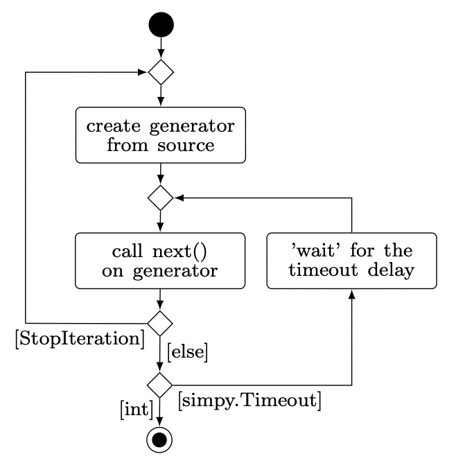

.. _function_file:

Production functions
--------------------

The functions input file is a Python script in which the user defines all of the functions used in the process input
file. The functions must be defined in the global scope and can be classified as follows

* :ref:`Process function <process_function>`
* :ref:`Source and sink <source_sink>`
* :ref:`Global function <global_function>`
* :ref:`Distribution <distribution>`

.. note::

   The following subsections describe only the structure and functionality. The use of these functions is presented in
   chapter 3 (:ref:`Examples <examples>`).

....

.. _process_function:

Process function
****************

All process functions referenced in the orders under the ‘function’ attribute must be defined in the function input
file. The process functions are used to represent machining or assembly operations, and each of these functions has four
arguments: *env*, *item*, *machine*, and *factory*. The following paragraphs explain what these arguments are used for:

**env**

The argument env points to the reference of the simulation environment of the simulation kernel. This reference can be
used to access the current simulation time via the attribute now to make the behavior of the process function dependent
on the simulation time.

.. code:: python

   current_sim_time: float = env.now

In addition, this reference is used to set the current process to the *active without control* state. For this purpose,
a *simpy.Timeout* event is yielded through *env*. The duration of the release of control is controlled by a time
interval passed in the process. The machine is blocked for this time such that, for example, maintenance or processing
times can be mapped.

.. code:: python

   # Using a random delay
   delay: float = normalvariate(10, 0.2)

   # Delays must be positive
   yield env.timeout(abs(delay))

.. note::

   Any number of timeout events can be yielded in a process function, whereas returns are only used to manage the
   control flow if necessary.

**item**

Through the argument *item*, all references to workpieces involved in the process can be accessed. The following table
displays which information is available.

.. list-table::
   :widths: 6, 3, 3, 16
   :header-rows: 1

   * -
     - Read
     - Write
     - Access
   * - attributes
     - `+`
     - `+`
     - `item.attr_1` (e.g.)
   * - id
     - `+`
     - `-`
     - `item.item_id`
   * - name
     - `+`
     - `-`
     - `item.name`
   * - reject
     - `+`
     - `+`
     - `item.reject`

The following figure illustrates what the item access structures look like when the workpieces are nested or the demand
of the process is greater than one.

.. image:: ../Figures/assembling_structure.png
   :align: center
   :width: 32%
   :alt: distribution_normal

The item attribute always references the main workpiece of a process – itemA in this case. The figure shows that two
workpieces of type itemC were assembled into itemA. Whenever the quantity is greater than one, the references are stored
in lists. The access to an attribute (e.g., *attr_1*) of the first of the two itemC items looks as follows:

.. code-block:: python

   item.itemC[0].attr_1

If two (or more) workpieces of the same type were assembled in different assembly steps (see *itemB*), then access would
be made in a special way. Starting from the second workpiece, the references are supplemented by the prefix ‘_’ and a
continuing suffix. Thus, identical workpieces from different process steps can be differentiated. Assuming the middle
itemB was mounted second, access from its attributes (e.g., *attr_2*) would be as follows

.. code-block:: python

   # accessing, the first assembled itemB
   item.itemB.attr_2

   # accessing, the second assembled itemB
   item._itemB2.attr_2

This structure can be nested as far as required. Thus, access to attributes (e.g., *attr_3*) of itemD is through
*itemB*:

.. code-block:: python

   item.itemB.itemD.attr_3

**machine**

The *machine* argument can be used to reference the attributes of the machine on which the machining takes place. In
addition, each machine of a station has its own number.

.. list-table::
   :widths: 6, 3, 3, 18
   :header-rows: 1

   * -
     - Read
     - Write
     - Access
   * - attributes
     - `+`
     - `+`
     - `machine.attr_1` (e.g.)
   * - machine nr
     - `+`
     - `-`
     - `machine.nr`
   * - name
     - `+`
     - `-`
     - `machine.name`

Since there are no nested structures as with the items, access is always via *machine.attr_name*.

**factory**

All global attributes can be reached through the *factory* reference. These can also be assigned new values from process
functions.

.. code-block::

   factory.global_attr

However, the behavior of the global attributes is not so controllable since, particularly with stochastic processes, how
often or when a process function is called is not known. Therefore, the global attributes should only be set based on
:ref:`global functions <global_function>`.

....

.. _source_sink:

Source and Sink
***************

Each job has exactly one source and one sink. Their tasks are to create workpieces in the production process and to
remove them after they have passed through the process. By matching the behavior of the source and sink, a push or pull
material flow can be configured in the production system.

A source or sink is defined as a function in the global scope in the function input file and must match the values of
the *sink* and *source* attributes of the orders. Such a function has exactly two arguments: *env* and *factory*. As
described for the :ref:`processes <process_function>`, through these arguments the user can access the current
simulation time and generate timeout events, and access to global attributes is provided.

The following figure illustrates the logic of the source and sink functions. These functions can yield any number of
objects of type int or *simpy.Timeout*. As soon as an *int* value is yielded, the iteration over the source or sink
(generator) is aborted, and the yielded value corresponds to the number of workpieces that the source/sink
generates/removes. If no int value is yielded, then the iteration stops after the last yield and starts again.

If no sink is defined, then the default sink removes all workpieces from the corresponding end storage without any time
delay (if no assembly workpieces are taken from this store for another order). If workpieces are always to be ready for
production, an infinite source can be defined. For this purpose, the storage of the corresponding buffer memory must be
and an *int* value from the source must be yielded as the first value. Thus, the source always fills up the storage
without a time offset and stops when it is full.

.. code-block:: python

   # Define an infinite source
   def infinite_source(env, factory):
       yield 1

:ref:`Example 03 <3>` gives a concrete example of the interaction of an infinite source and sink with a demand
curve over time.

....

.. _global_function:

Global function
***************

Global functions are specified via the *functions* attribute of the *factory* object and defined in the global scope of
the function input file. The task of the global functions is to control the behavior of the global attributes. Global
functions get two arguments: *env* and *factory*. Through env, as already shown with the
:ref:`process functions <process_function>`, *timeout* events can be generated and the simulation time can be queried,
while factory is used to obtain access to the global attributes to assign new values to them depending on the time. The
following figure presents the required structure of a global function schematically:

.. image:: ../Figures/global_func_logic.png
   :align: center
   :width: 38%
   :alt: distribution_normal

First, the global attributes are assigned updated values; arbitrarily nested structures can be used. Subsequently, at
least one *timeout* event must be yielded. This is because the global functions are executed parallel to the simulation in
an infinite loop; without a *timeout* event, the simulated time would not progress.

Example :ref:`02 <2>` demonstrates how to assign a time profile to global variables. Example :ref:`03<3>` illustrates
how global functions can be used to influence the behavior of the production system.

....

.. _distribution:

Distribution
************

The user-defined distributions that can be assigned to the attributes of the simulation objects are also defined in the
global scope of the function input file. For content reasons, the structure of these functions is introduced together
with the  :ref:`attribute distributions <user_defined>`.
