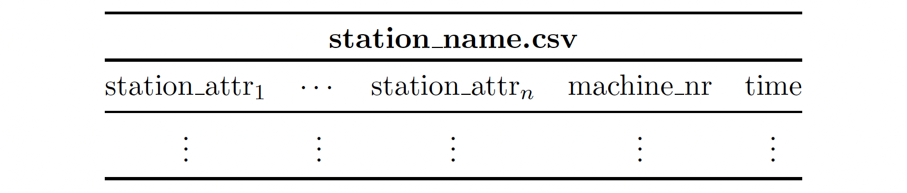

.. _output_file:

Simulation output
=================

Two predefined output formats are available: csv and hdf5. In both formats the output is provided in tabular form. In
the case of csv, a file is created for each simulation object (station, order, factory) whose data should be saved. In
the case of hdf5, a single file is created that contains a group for each simulation object.

The :ref:`general structure<general_structure>` of the output files is described first, followed by the specifics for
the individual simulation objects (:ref:`station<output_station>`, :ref:`order<output_order>`,
:ref:`factory<output_factory>`).

====

.. _general_structure:

General structure
*****************

The output files are in tabular form, to which rows are added during simulation. The first columns contain all
user-defined attributes and the following columns contain some object (station, order, factory) specific information.

For the tables of stations and orders it applies that for each processing that is carried out on a machine of a
station, the corresponding table of the order and the station are extended by a row that containing the relevant
information regarding the time point at which the respective interaction is completed. Whereas the factory table is
extended by one row after each call of a global function.

====

.. _output_station:

Output station
**************

The first columns contain the respective user-defined values of the station attributes. While the last two columns
contain the machine number and the current simulation time.

The **machine number** corresponds to the index of the machine of a station. The index starts for each station with
zero and can be read during the simulation to implement machine specific behavior.

The simulation **time** corresponds to the time point in which a machining or assembly operation was completed
successfully at a machine.

====

.. _output_order:

Output order
************

Similar to the output files of the other simulation objects, the first columns contain the values of the user-defined
attributes. The following columns contain the item ID, assembly comp, station ID and simulation time.

.. image:: ../Figures/output_file_order.png
   :align: center
   :width: 80%
   :alt: output_file_station

The **item ID** is a unique integer ID increasing throughout the simulation.

The column **comp** is only included if items of the order are assembled to items of another order in the process. The
column contains the unique item ID of the item to which the item referred to in the column is assembled.  If the item
is not assembled in the first stage, the value nan will appear in the rows created before this assembly.

The **station ID** is the ID of the station at which the corresponding row was added. The station ID is assigned
automatically and corresponds to the index position (starting with 0) of the station in the input JSON file.
Additionally, there is the index *-1*. This index corresponds to the rows that are added directly after the creation of
new items in the source.

The simulation **time** corresponds to the time point in which a item was processed successfully at a machine.

====

.. _output_factory:

Output factory
**************

The first columns contain the values of the user-defined global attributes. While the last column contains the
simulation time at which the attribute values of the attributes were recorded.

.. image:: ../Figures/output_file_factory.png
   :align: center
   :width: 80%
   :alt: output_file_station

.. note::
   Different from the stations and the orders, a row is created after each execution of a global function. If there are
   no global functions, no rows are added. In this case an *empty* global function can be created, which only yields
   timeouts in required time steps.