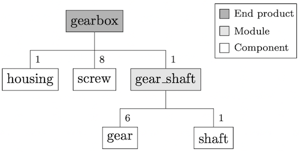
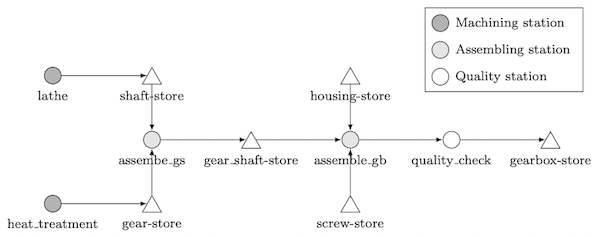

# Example 01

## Table of Contents 

* [Purpose of this example](#purpose)
* [File structure](#file_structure)
* [For trying out](#try_out)

## <a id="purpose"></a>Purpose of this example

The first example only serves to show how a production process with machining and assembly steps can be defined and 
which operations should be performed on the input data before the first simulation. The individual process functions are 
here without content, and the workpieces do not have any attributes. The following figures show the product tree and 
process structure. 





## <a id="file_structure"></a>File structure

```
. example01
|--data/
| |--function.py
| |--process.json
|--figures/
| |--gearbox_process.png
| |--gearbox_tree.png
|--example01.py
|--README.md 
```

The ``example01`` folder already contains all the fully prepared files that are necessary to perform the steps 
described, in the documentation. The subfolder ``data`` contains the two process input files, while ``example01.py`` 
contains the script to execute the process steps. 

## <a id="try_out"></a>For trying out

In the script ``example01.py`` first the input files are read into a newly created environment. Then the user can call 
the ``inspect()`` and ``visualize()`` functions. Both functions can be called at the same time, but separate calls are 
recommended. 

If ``inspect()`` is called, the following output should be printed. 

```
progress station: [====================] 100%  quality_check
progress order:   [====================] 100%  shaft
factory:          [====================] 100%  factory
WARNINGS-------------------
EXCEPTIONS-----------------
---------------------------
Number of Warnings:    0
Number of Exceptions:  0
---------------------------
```

When ``visualize()`` is called, the following output should be printed. Clicking on the link 
(``http://127.0.0.1:8050/``) opens a browser window with the interactive graph (If the script is executed in a shell or 
in an IDE that does not offer corresponding functions, the link can be copied and opened manually in the browser). 

```
Dash is running on http://127.0.0.1:8050/

 * Serving Flask app 'ProdSim_app' (lazy loading)
 * Environment: production
   WARNING: This is a development server. Do not use it in a production deployment.
   Use a production WSGI server instead.
 * Debug mode: on
```

For better understanding, typical errors can be inserted into the input files (for example, changing the signature of a 
process function) and the ``inspect()`` method can be called again. The inserted errors should be displayed in the 
output. 

Concerning the ``visualize()`` method, it is recommended to get familiar with the graph and try different functions 
(moving the image, moving individual nodes, clicking on any node, selecting the drop-down menu).