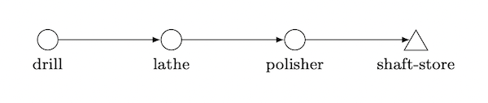

# Example 02

## Table of Contents 

* [Purpose of this example](#purpose)
* [The modeled process](#process)
* [File structure](#file_structure)
* [For trying out](#try_out)

## <a id="purpose"></a>Purpose of this example

The focus of this example is on the definition of machining functions. In addition, global attributes are used and 
controlled by global functions.  
  
## <a id="process"></a>The modeled process

For better understanding, a simple linear process is used. This involves the machining of shafts in a tact-based line 
production (tact time: one minute). The following figure shows the process graph as it is also generated by the 
``visualize()`` method. 



First, the shafts are drilled, then turned and finally polished. The aim of this simulation is to model the course of 
the surface quality of the shafts over time. 

## <a id="file_structure"></a>File structure

```
. example02 
|--data/
| |--function.py
| |--process.json
|--figures/
| |--shaft_process.png
|--output/
| |--shaft_surface_pre_run.png
|--example02.py
|--README.md
```

The folder ``example02`` already contains all the files needed to run the simulation. The subfolder ``data`` contains 
the two input files in which the production process is defined. In the script ``example02`` the input files are loaded 
in a newly created simulation environment, and the simulation is started. In addition, the script contains a function 
for plotting the simulation data. After the simulation, the exported simulation data is stored in the ``output`` 
subfolder. This folder also contains an image of the expected output. 

## <a id="try_out"></a>For trying out

The ``inspect()`` and ``visualize()`` methods can be called, but they do not reveal anything new at this point, since 
the input files have already been checked. 

When executing the two methods ``simulate`` and ``data_to_csv``, the following process bar should appear and scroll 
during the simulation. 

```
simulation progress: [====================] 100%
```

After the simulation the file ``shaft.csv`` will be created in the subfolder ``output``, which contains the output 
data (The data contained in this file is already plotted in the file ``./output/shaft_surface_pre_run.png``). 

To build up a better understanding, the implemented machining functions can be modified, and the simulation can be run 
again (Attention: the output files which have been created before have to be deleted, because they might not be 
overwritten). To visualize the result the script ``example02`` contains the commented function ``plot_surface()`` which 
plots the surface over time and creates a corresponding file in the output folder (Attention: to call this method pandas 
and matplotlib must be installed). 
