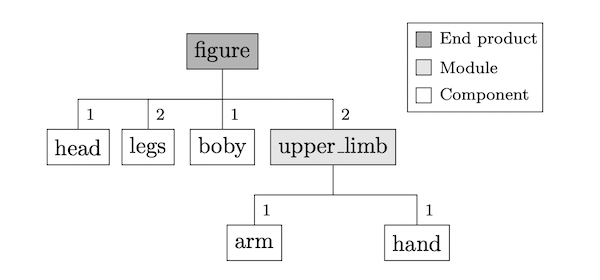
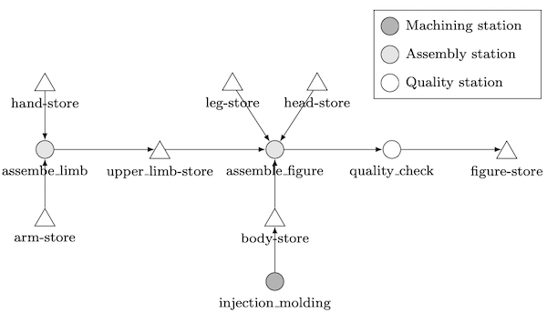
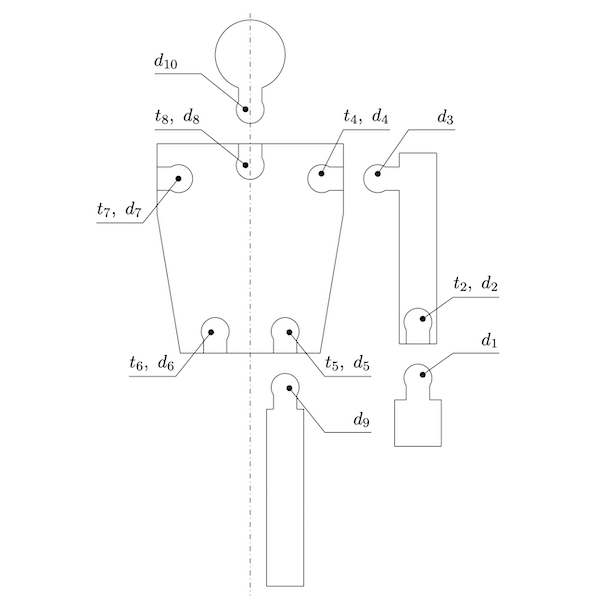

# Example 04

## Table of Contents 

* [Purpose of this example](#purpose)
* [The modeled process](#process)
* [File structure](#file_structure)
* [For trying out](#try_out)

## <a id="purpose"></a>Purpose of this example

This example shows how assembly processes can be simulated with ProdSim. Furthermore, it is shown how workpieces can be 
rejected from the production process and how the simulation output can be transformed according to the given problem.

## <a id="process"></a>The modeled process

The following product tree gives an overview of all components, their quantities as well as their hierarchical assembly 
relationship. 



As shown in the following process graph, all parts except for the ``body`` are manufactured externally (this can be seen 
from the fact that the other components do not have their own processing steps in the process under consideration). In 
addition, it becomes clear, as it can be recognized already in the product tree, that the component ``upper_limb`` is 
assembled first, which is then assembled together with the other components to the figure. 



The following figure gives an overview of all the attributes that the different workpieces have. Due to symmetry, both 
arms, legs and hands have the same attributes. The tensions t are the result of the corresponding diameters d. Since the 
tension is only determined during assembly, it is an attribute of the final product, i.e. of the ``upper_limb``. 



## <a id="file_structure"></a>File structure

```
. example04
|--data/
| |--function.py
| |--process.json
|--figures/
| |--figure.png
| |--figure_process.png
| |--figure_tree.png
|--output/
| |--rejected_profile_pre_run.png
|--example04.py
|--README.md 
```

The folder ``example04`` already contains all the files needed to run the simulation. The subfolder ``data`` contains 
the two input files in which the assembly process is defined. In the script ``example04.py`` the input files are loaded 
in a newly created simulation environment, and the simulation is started. In addition, the script contains a function 
for data transformation and a function for plotting the simulation data. After somulation, the exported simulation data 
is stored in the ``output`` subfolder. This folder also contains an image of the expected output.

## <a id="try_out"></a>For trying out

During the simulation, a progress bar should appear that scrolls from 0% to 100%. 

```
simulation progress: [====================] 100%
```

After the simulation is finished, 13 csv files are created in the ``output`` folder (one for each component and 
station). The functions ``merge()`` and ``plot_rejected()`` use this data.

``plot_rejected()`` generates a plot representing the cumulative number of rejected parts over the simulated time (for 
the reject reasons r6, r7 and r8). ``merge()`` reads all csv files belonging to workpieces and combines them according 
to the underlying assembly structure to a single csv file (Attention: to call this method pandas and matplotlib must be 
installed). 

In order to better understand the structure of the output files, it is recommended to implement a method that filters 
the workpieces declared as rejects at the ``quality_check`` station. A possible approach is presented in the 
documentation. 
