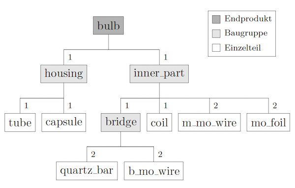
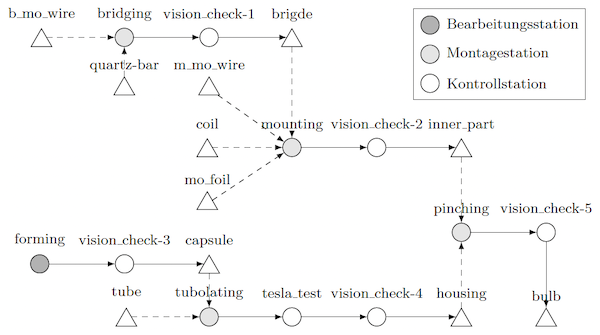

# Example 01

## Table of Contents 

* [Purpose of this example](#purpose)
* [The modeled process](#process)
* [File structure](#file_structure)
* [For trying out](#try_out)

## <a id="purpose"></a>Purpose of this example

This example contains the two input files of the assembly process of the light bulbs. The process functions are without 
content, and the attributes of the components serve only as an example. The purpose of this example is to provide the 
elementary structure of the production process of the light bulbs, so that for further studies only the desired process 
functions must be implemented. 

## <a id="process"></a>The modeled process

The following two figures are taken from the bachelor thesis and serve as an aid regarding the attribute access 
structures when implementing the process functions. 





## <a id="file_structure"></a>File structure

```
. example_bulb
|--__pycache__/
|--data/
| |--function.py
| |--process.json
|--figures/
| |--bulb_process.png
| |--bulb_tree.png
|--output/
|--example_bulb.py
|--README.md 
```

The folder ``example_bulb`` contains all files necessary for the execution of the simulation (these are in the provided 
version, apart from the process itself without concrete contents). The subfolder ``data`` contains the two input files. 
In the subfolder ``output`` the csv files are stored after the simulation.  The script ``example_bulb.py`` is used to 
call the simulation. In addition, this script contains two functions that are used to transform the simulation data. 

## <a id="try_out"></a>For trying out

As an example, the components of the light bulb were given some attributes so that some data can be tracked when running 
the simulation. After the simulation data has been saved in the corresponding csv files, the two methods ``merge()`` and 
``get_rejected()`` can be called. These two functions were already introduced in the bachelor thesis.

``merge()`` combines the generated csv files according to the underlying assembly structure of the light bulbs. 

``get_rejected()`` filters rejected and fully assembled inner_part components from the output files. Here the 
alternative approach from ``example04`` of the documentation is used. For this purpose, during the simulation at the 
station mounting, random inner_part components are declared as rejects (item.reject = True). 

Note: To execute these two methods, the library pandas must be installed. 